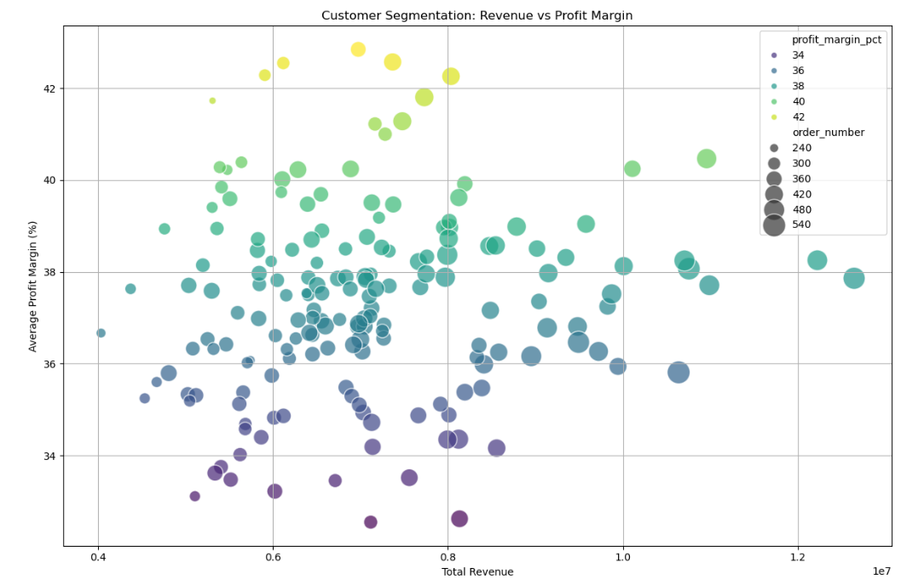

# Regional Sales Data Analysis (2014–2018)

> **Note:** This project was built while following a YouTube tutorial to practice MySQL and Power BI for HR data analysis. The goal was to understand the concepts and apply them. Any modifications or experiments I made are my own.

# Overview

This project explores Acme Co.'s sales data from 2014 to 2018 to uncover actionable insights across products, customers, channels, and regions. The goal is to inform strategic decisions around pricing, promotions, and market expansion.

## Files

- `regional-sales-dataset.xlsx`: Original dataset  
- `cleaned-dataset.csv`: Final cleaned dataset  
- `python-analysis.ipynb`: Full analysis notebook  

## Data Workflow

- Source: Multi-sheet Excel file containing sales orders, customer details, product info, regional mappings, and 2017 budgets  
- Cleaning: Standardized headers, merged datasets, removed redundant columns, and normalized column names  
- Feature Engineering:  
  - `total_cost = order_quantity × unit_cost`  
  - `profit = revenue − total_cost`  
  - `profit_margin_pct = profit ÷ revenue × 100`  
- Filtering: Excluded Jan–Feb 2018 to ensure consistent seasonal analysis  

## Visual Highlights

### Monthly Sales Trend  
  
Sales peak in May, August, and December. February, April, and June show the lowest revenue.

### Top 10 Products by Revenue  
  
Product 26 and Product 25 dominate revenue, far ahead of other top 10 products.

### Worst Performing Products  
  
Product 3 contributes the least, but even low performers generate substantial revenue.

### Sales by Channel  
  
Wholesale accounts for 54.1% of total sales. Export lags at 14.6%, suggesting growth potential.

### Unit Price Distribution  
  
Some products show tight pricing consistency; others reveal broader spreads and outliers.

### Top States by Revenue  
  
California leads by a wide margin—nearly double the revenue of second-place Illinois.

### Top States by Order Volume  
  
California ranks first in both revenue and order volume, showing strong customer engagement.

### Top Customers by Revenue  
  
Aibox Company leads, followed by State Ltd and Pixoboo Corp—ideal for retention and upselling.

### Customer Segmentation  
  
Larger bubbles in the upper-right quadrant show high-value, high-margin, high-order clients.

### Correlation Heatmap  
  
Revenue strongly correlates with order quantity (0.90) and unit price (0.79). Profit rises with revenue (0.87).

## Key Insights

### Top Performers  
Product 26 and Product 25 lead in revenue  
Wholesale dominates sales; Export offers margin upside  
California is the top region by both revenue and order volume  

### Seasonal Trends  
Strong demand in May, August, and December  
February, April, and June are slower—ideal for promotions or cost-saving measures  

### Pricing and Margin Risks  
Unit price outliers highlight inconsistent pricing  
Profit margin improves with higher unit prices and lower costs  
Revenue is driven by order quantity and unit price  

### Strategic Opportunities  
High-value customers identified for retention and upselling  
Export and Distributor channels offer higher margins  
California should remain a priority for investment  
